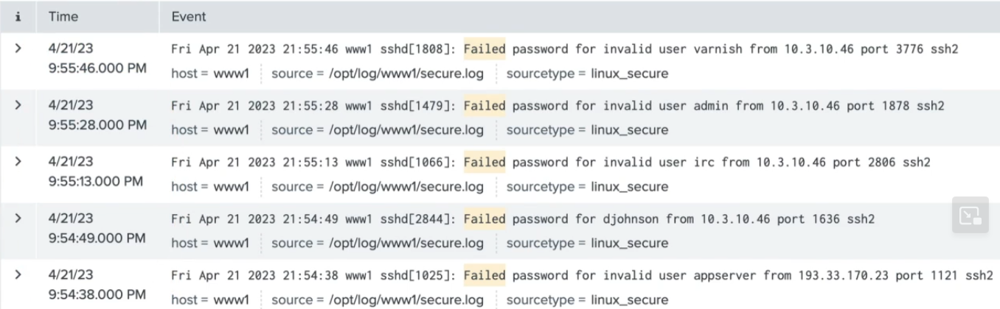
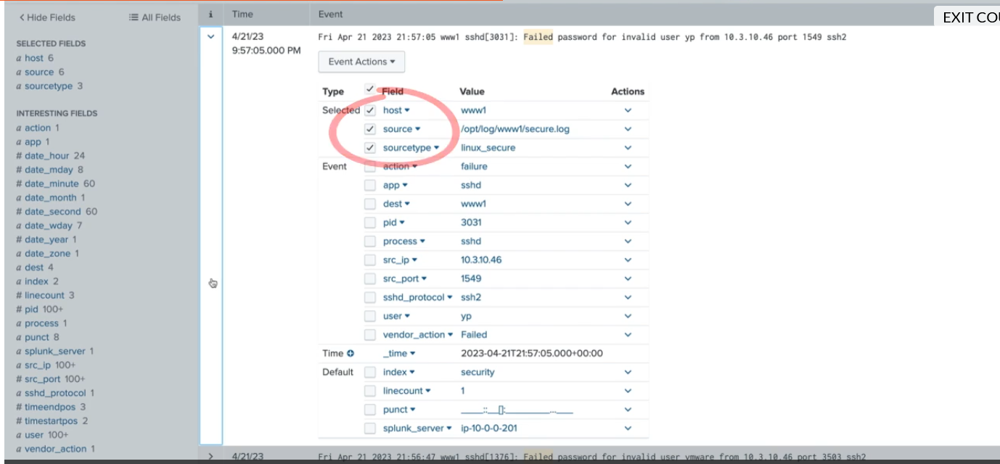
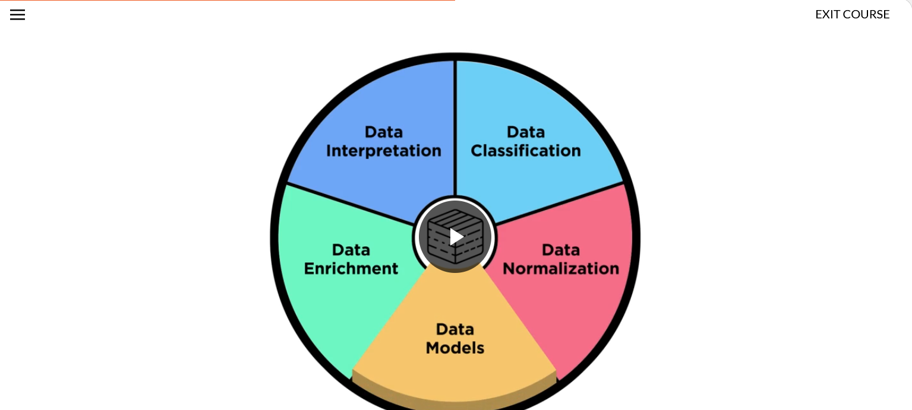
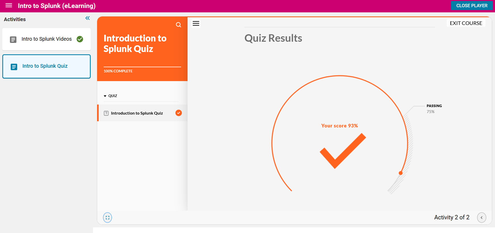

## Intro To Splunk ##
been want to learn this tool for a long time coming, super happy I get to get some real experience at a entry-level position!  

__Goals of the Course:__
- Exploring splunks features
- Running searches
- Using commands
- Creating reports
- Creating dashboards
- Understanding knowledge objects

### Splunk? ###
splunk is a Security Information Event Manager that allows the normalization of logs and events from almost all devices on a network in order to alert, troubleshoot, and deal with errors and issues on a system.  

with querying tools, searching indexs, visualization data, and more, splunk allows you to deal large scale networks without being complelety overwhelmed.  

__Three Default Roles in Splunk:__
- Admin: create knowledge objects, ingest new data, install apps
- Power: perform real time searchs and can create knowlege objects
- User: can view knowledge objects

Splunk has a bunch of add-on apps / API's that can be added to a users terminal.  

### Searching with Splunk Basics ###
_Using Searches?:_  
- at its simplest, a search will be based of its textual input, in which other parameters are important to add.
- time frame is most important in order to increase search speed, especially with large-scale networks.
- hitting save as can make so you can either save the item as a knowledge item.
- Fast, Smart, and Verbose Query Responses!
- searches are NOT case sensitive

Under the search you can have different outputs display such as:
1. All events
2. Patterns
3. Statistics
4. Visualization

__by default, a search job remains actived for 10 minutes, but shared will be for 7 days.__  

1. Search Term will be highlighted
2. Search results will be filtered from reverse-chronalogical order (newest items show up at the top)
3. Time will show up depending with selected timezone. For creating a timeline for a event, it may be beneficial to change to UTC to enforce universal time synchronization. 
4. Selecting additional text in a search can add it to the searching parameters in order to further refine a search. 

5. Via selecting an event, you can see what views were shown in the search result, and click on subfields for additional information

7. Boolean parameters like AND OR and NOT can be used!

_wildcard symbol_ --> * (just like regex, with return anything with the attached requirements)  
Example:      any* --> will return any searchs that match with the being "any" and everything after  

Boolean Order of Operations:  
1. NOT
2. OR
3. AND
4. Parathesis can be used to bypass order of operations!
5. \ to search for special characters

### Using Search Commands ###

in splunk there is (IMPORTANT, KNOW THIS)
* Search Terms: data items that are trying to be matched
* Commands: what to do with search results
* Functions: how to chart, compute, and evaluate searches
* arguements: variables to apply to function
* clauses: how to group and define results

index=network sourcetype=cisco_wsa_squid usage=violation | stats count(usage) as Visits   

__index=network sourcetype=cisco_wsa_squid usage=violation__ --> search term  

| --> pipe, used to concat commands together
_stats_ --> command
_count(usage)_ --> function is count, in which it takes the parameter of usage 
_as Visits_ --> clause that defines the result of the function as Visits

__by username__ --> then sorts data by users in SIEM
| --> pipe
__search xUsername__ --> search for certain user!

Besides time ... 
- Index, source, host, and sourcetype are some the stronger parameters to use to narrow a search. 

### Knowledge Objects ###

__Data Interpretation:__ output of data fields, which can also be calculated at search time
__Data Classification:__ organization of data into event types, transactions 
__Data Enrichment:__ additional of extra fields and values to events for enhancing searching
__Data Normalization:__ organization of data through tagging and aliases
__Data Models:__ Heirarchically structured datasets, turning data to visualized information

knowledge objects are great because they can be created by one user and shared to others to reuse and utilize in searches.  
its important however that knowledge object creation is monitored, implemented with good name conventions, and to avoid sprawl of non-important knowlegde items.  

Creating Reports?  
- After optimizating your search and finding potential IoC's, its important to be able to quickly export and escalate the issue if needed
- follow good naming conventions as talked about before!
- can be shared to different tiers of accounts in splunk system.
- Reports can be scheluded to keep track of important IOC's

### Creating Dashboards ###
data visualization helps information less technically prone stakeholders into understanding a situation / incident.  
dash boards can be just for you or shared with others  

_drilldown:_ allows for interactive dashboard utilization.  
dashboards == awesome  

Two formats:
1. Dashboard
2. Dashboard Studio --> like google draw version of dashboard for even greater visualization modifications.

