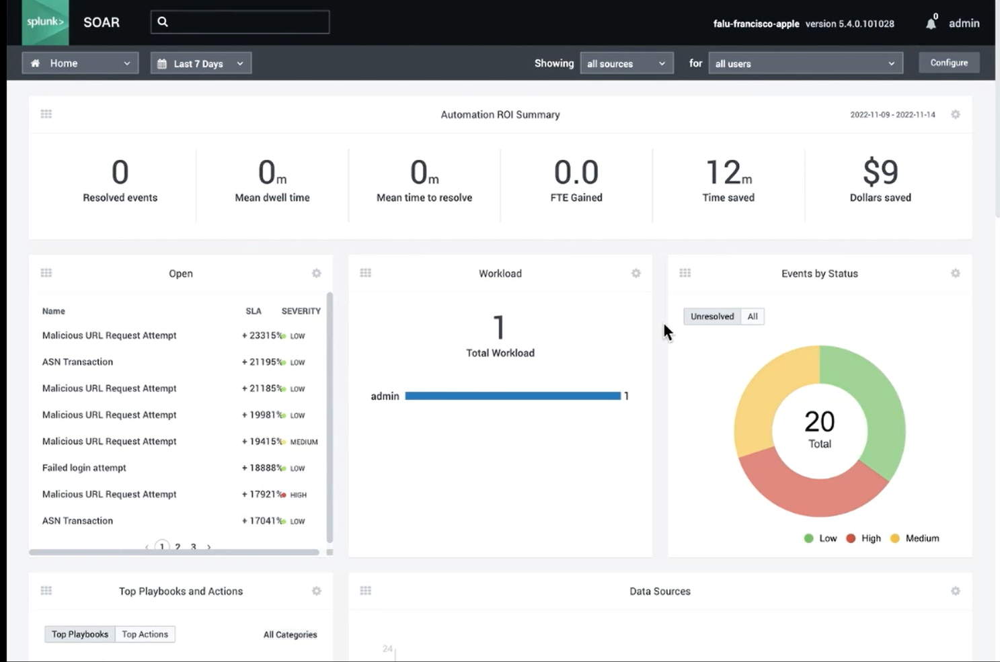
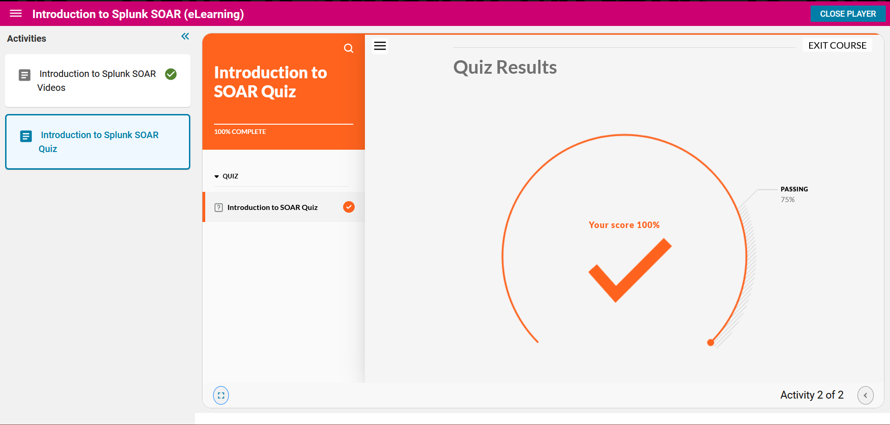

## Splunk SOAR ##
__Splunk Security Orchestration, Automation, and Response__
* The goal of SOAR is to make incident response easier and faster to response to, providing tools for automated and manual investigation into actions, events, and potential incidents. It also provides tools for collaborative approaches to security, and forensic evidence preservation of data for incident response / IR. 
* SOAR data will be stored into events of complied logs that may be potentially indicitive of a malicious event!
* SOAR makes decisions based off fead human input OR its source of automated script playbooks.
* from there, it is able to make potential actions, such as killin processes, isolate servers, disable accounts, delete files, and update event record+status.

### How does SOAR works? ###
1. SOAR User Interface
SOAR is a web app, which can be cloud based or installed on-prem.  
after authentication, you can view the ROI summary dashboard, showing current status of events in SOAR.  

2. Using the Dashboard
Events will be display in the main dashboard, ordered by criticality, and clicking onto an event will link to all artifacts related to events, and actions that are able to be done.  
__Artifacts:__ important event data gets stored into artifacts, which contains at least one or more name/value pairs. These artifacts is what allows SOAR to work and analyze an incidents, make decisions, and take action.  
Events can be claimed for ownership, by default, no one is automatically assigned.  
3. Doing Actions
Actions in SOAR can either be done manually or automatically:
* _manual:_ click artifact value, and select desired action, which will depend on the context of the data, and configured action libraries in your splunk SOAR server. 
* _automatic / playbook:_ script that can run using artifacts as input, which can either be done when an events data is first ingested, or if new artifacts are added to an event. 
    - playbooks have three status ....    active, inactive, and draft 
    - VPE / Visual Playbook Editor:    make responses for non-coders (think like scratch blocks)

