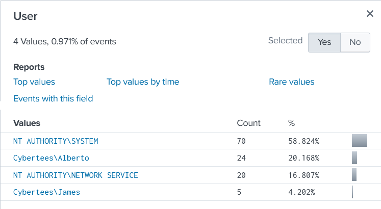

## Splunk TryHackMe Lab ##
time to get some practical searching done! <br>
in this lab, index=Windowslogs

1. What is the name of the host in the Data Summary tab?
__cyber-host__ <br>
first search ideas i did was to narrow down the time to where the events where:
```index=Windowslogs (all time)```
from that, i know the time frame of events was from April to August, but more specifically, most events were on april 15th, and 6 events came in july. <br>
```index=Windowslogs earliest="04/14/2022:00:00:00" latest="08/01/2022:00:00:00"```
this gives the time frame I want! <br>
looking at the fields sidebar, I see the selected ones, which are host, sourcetype, source, and User. <br>

_Users on the host of Windowslogs:_


2. In the search History, what is the 7th search query in the list? (excluding your searches from today)
_index=windowslogs | chart count(EventCode) by Image_<br>
3. In the left field panel, which Source IP has recorded max events?
_172.90.12.11_<br>  (found it by looking at SourceAddress field)
4. How many events are returned when we apply the time filter to display events on 04/15/2022 and Time from 08:05 AM to 08:06 AM?
__134__<br>

Important Search Field Operators: <br>
* != = < <= > >=

5. How many Events are returned when searching for Event ID 1 AND User as *James*?
```  index=Windowslogs earliest="04/15/2022:00:00:00" latest="08/01/2022:00:00:00" EventID=1 User="Cybertees\\James" ```
_4_<br>
6. How many events are observed with Destination IP 172.18.39.6 AND destination Port 135?
```  index=Windowslogs earliest="04/15/2022:00:00:00" latest="08/01/2022:00:00:00" DestinationIp=172.18.39.6 DestinationPort=135 ```
_4_<br>
7. What is the Source IP with highest count returned with this Search query? index=windowslogs  Hostname="Salena.Adam" DestinationIp="172.18.38.5"
piped an additional command to see the stats of the sourceIP's <br>
``` index=Windowslogs Hostname="Salena.Adam" DestinationIp="172.18.38.5" earliest="04/15/2022:00:00:00" latest="08/01/2022:00:00:00" | stats count by SourceIp ```
_172.90.12.11_<br>
8. In the index windowslogs, search for all the events that contain the term cyber how many events returned?
0 <br>
9. Now search for the term cyber*, how many events are returned?
12256 <br>
10. What is the third EventID returned against this search query? index=windowslogs | table _time EventID Hostname SourceName | reverse  
4103 --> Powershell Command Executed <br>
11. Use the dedup command against the Hostname field before the reverse command in the query mentioned in Question 1. What is the first username returned in the Hostname field?
Salena.Adam <br>

Head Tail Sort Commands work in Splunk! <br>

12. Using the Reverse command with the search query index=windowslogs | table _time EventID Hostname SourceName - what is the HostName that comes on top?
James.browne <br>
13. What is the last EventID returned when the query in question 1 is updated with the tail command?
4103 <br>

cool command i made! sorts events by there windows eventID and number of occurences within the given time frame. <br>
``` index=windowslogs earliest="04/14/2022:00:00:00" latest=now() | stats count by EventID | sort count | reverse ```

14. List the top 8 Image processes using the top command -  what is the total count of the 6th Image?
``` index=windowslogs earliest="04/14/2022:00:00:00" latest=now() | top limit=8 Image ```
_196_<br>
15. Using the rare command, identify the user with the least number of activities captured?
_James_<br>
16. Create a pie-chart using the chart command - what is the count for the conhost.exe process?
``` index=windowslogs earliest="04/14/2022:00:00:00" latest=now() | chart count by Image ``` 70 <br>

BRO I UNDERSTAND IT NOW THIS TOOL IS LIKE SO AWESOME! <br>