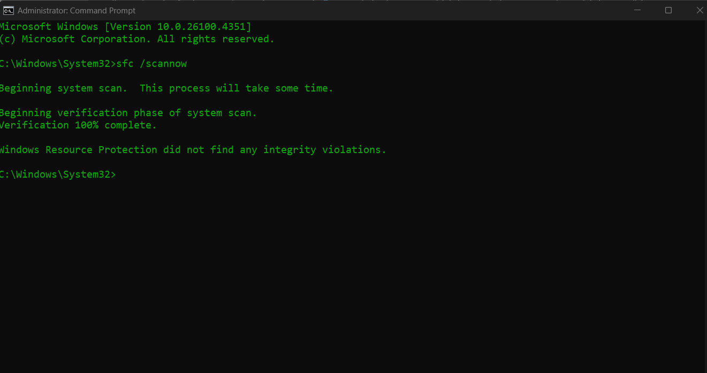

## Analyzing Host-Based IoC's ##
fun section imo!
### Host-related IoC's ###
last section focused on the network --> this one we are considering hosts:  
- windows, linux machines, endpoints, servers ...

different section will consider mobile IoC's

### Malicious Processes ###
me when the process is malicious :p  

1. create a system baseline!
monitor when new process that are added and determine if they are sussy or not.  

__Malicious Process:__ a process executed without proper authorization from the system owner for the purpose of damaging or compromsing the system.  
__Abnormal Process Behavior:__ indicator that a legitimate process has been corrupted with malicious code for the purpose of damaging or compromising the system.  

__Windows Tools to Determine IOC's:__
- System File Check - SFC

- Process Monitor
- Process Explorer
- Tasklist
- Task Manager
- PE Explorer (properitary)
__Linux Tools:__
- PS / pstree

SO Objects == Windows DLL's  
### Memory Forensics ###
YAY!  
__Fileless Detection Techniques:__ require analysis of the contents of system memory and process behavior, rather than relying on scanning the file system.  
__Memory Analysis Techniques:__ attempt to reverse enginner the code used by the malicious process, discover how it interacts with the file system, and how it interacts with the registry.  

FTK, EnCase, Volatility, Sleuth Kit, Memoryze ...  

VOLATILITY MENTIONED!!! (hate this fricking tool sometimes)  
### Consumption ###
### Disk and File System ###
### Unauthorized Privilege ###
### Unauthorized Software ###
### Unauthorized Change/Hardware ###
### Persistence ###
