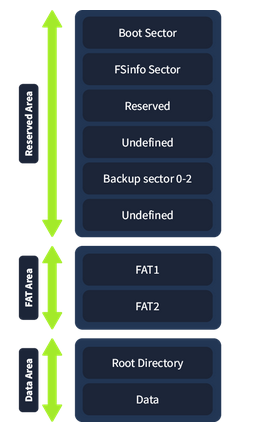

## FAT32 File Structure File Analysis / Incident Response - TryHackMe ##
pretext -> machine is a 2019 Windows Server 2019 VM with forensics tool preinstalled, in which all files need will be located in C:\FAT32_analysis\  

### FAT32 Relevance in Cybersecurity ###
_FAT32_ --> File Allocation Tabel 32-bit  
- File Size limit of 4GB
- Volume Limit of 2TB
- High compatibility with OS's
- Lacks folder and file permissions

even though it came out almost 30 years ago ... still WIDELY used today in USBs, IOT, embedded systems, cameras, and legacy devices because of its lightweight design and high compatibility with basically any operating system!  

Attack Techniques, Tactics, and Procedures Covered in this Room:  
- Direct Volume Access
- Hidden Files and Directories
- Hidden Artifacts: Hidden File System 
- File Deletion
- Timestomping
- Clearing Persistance
- Binary Padding

why know fat? well USB attacks will MOST likely come from a usb that is using FAT32 due to its high compatibility for any device!  
* Stuxnet Israel Network Worm :C
* Mustang Panda Chinese-State APT
* UNC4990 Threat Actor
* Rubber Ducky --> usb keystroke injection attack :O, think abt black hill info zine!

### FAT32 Structure: Reserved and FAT Areas ###
What do FAT32 File System structure and characteristics look like?  

#### FAT32 Structure ###
1. Reserved Area: 
- _Boot Sector / Volume Boot Record_
- _FSinfo Sector_
- _Reserved Sector_

2. FAT Area:
- _File Allocation Table_
- _Backup File Allocation Table / FAT2_

3. Data Area:
- _Root Directory_
- _Data Region_

__Sector:__ smallest addressable unit on a disk. Usually 512 bytes.  

FAT32 is usually in Little Endian  
#### Boot Sector ####

| Field | Subfield | Size | Offset | Explaination |
| :---: | :------: | :--: | :----: | :----------: | 
| JMP   |          |  3   |        | allows BIOS to bypass BIOS parameter block and execute boot code | 
| OEM   |          |  8   |        | contains name of original equipment manufactor that formated the disk |
| BPB   |          |      |        | contains metadata of volume that OS needs to read |
|       | Bytes per Sector | 2 |   | lists the size of sector |
|       | Sectors per Cluster | 1 |    | how many sectors are used in a cluster | 
|       | Reserved Sectors | 2 | | How many sectors are reserved for metadata | 
|       | Number of FAT's | 1 | | How many FAT tables are there in the partition, usually 2 |
|       | Maximun Root Directory Entries | 2 | | How many entries can the root dir contain |
|       | Total Sectors | 2/4 |  | number of sectors on formated volume |
|       | Media Descriptor | 1 | | Describes what type of media is the partition is on |
|       | Sectors per Fat | 2 | | List how large the FAT is | 
|       | Hidden Sectors | 4 | | indicate num of sectors before the start of the current partition |
|       | Cluster Root Directory | 4 | | Points to the cluster number that the root directory is located at relative to the beginning of the data area |
| Boot Code | | 420 | | Contains the data the BIOS needs to boot up |
| Boot Sector Signature | | 2 | | Used for validation of the boot sector | 

whole lotta yap :p  

