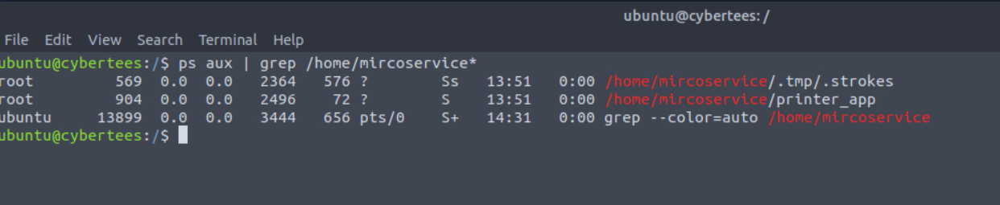
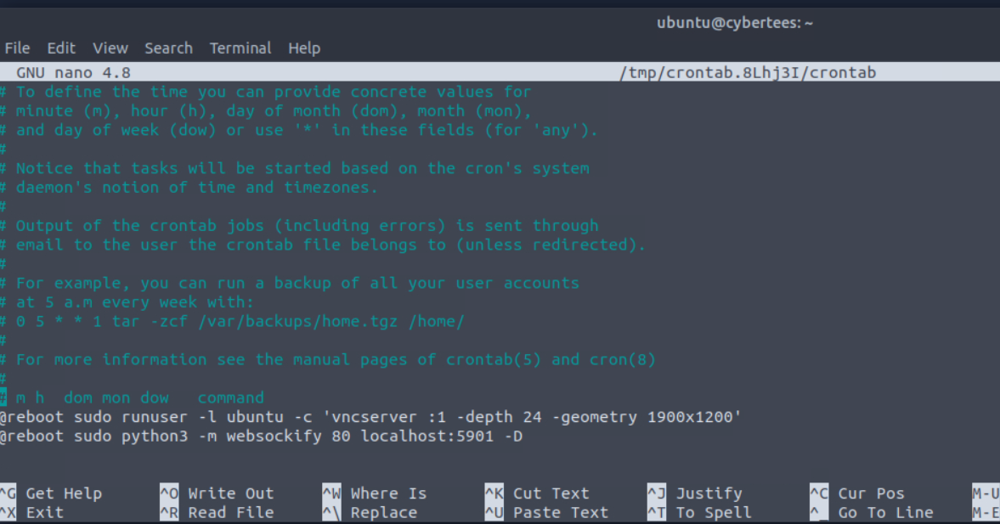
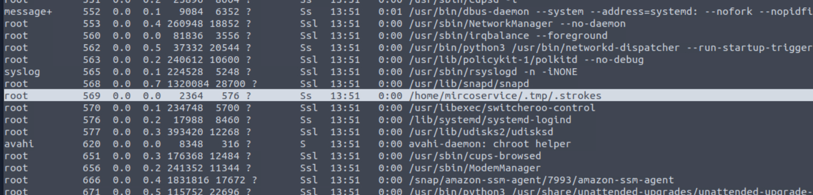
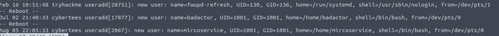

# Target Room - IronShade 

***20260609JS***

Scenario Report:
Based on the threat intel report received, an infamous hacking group, **IronShade**, has been observed targeting servers across the region. Our team had set up a and exposed weak and ports to get attacked by the group and understand their attack patterns. 

You are provided with one of the compromised servers. Your task as a Security Analyst is to perform a thorough compromise assessment on the server and identify the attack footprints. Some threat reports indicate that one indicator of their attack is creating a backdoor account for .

___Keywords:___ honeypot, ssh, footprints, backdoor account

## Beginning Analysis ##
from the initial context, lets get some initial data regarding the machine, and look for the backdoor user.

**Machine ID:** dc7c8ac5c09a4bbfaf3d09d399f10d96  
**Two ways to find the user:**
1. `ls /home` --> checks home directories of user, not fool-proof, account creation can skip this
2. `sudo cat /etc/shadow` --> check for non-service accounts, which will an asterisk fill after the account name to indicate they are non-interactive account

**Looking at all crontab entries, there is an interesting one found with the root user...**

`sudo crontab -u root -l` -->
@reboot /home/mircoservice/printer_app  

Looking now at the processes running on the machine, there is multiple lines that sticks out:

root 569 /home/mircoservice/.tmp/.strokes 
root 904 /home/microservice/printer_app

irregular hidden file in root dir: /.systmd 
irregular systemctl services:

backup.service, strokes.service  
`journalctl -t useradd`

`journalctl -u ssh`
`apt-mark showmanual` ***shows manually installed packages on a machine***
`apt show pscanner` -->  Secret_code{\_tRy\_Hack\_ME\_}

