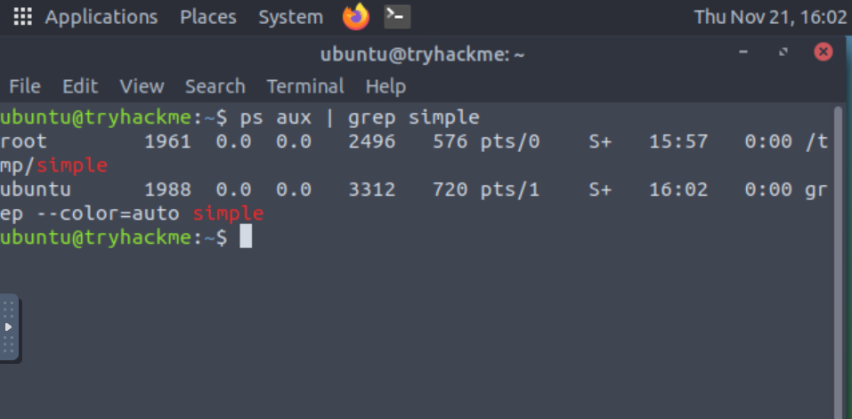
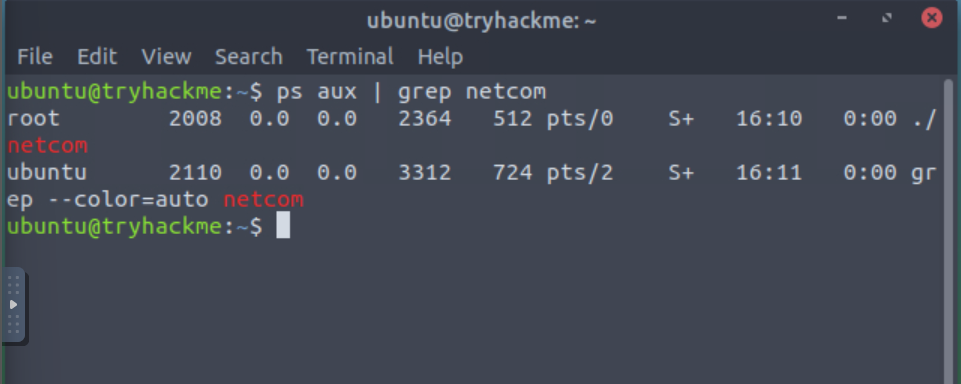

## linux incident surface ##
*forensics like challenge, navigate machine to learn abt incident response, and analyze security points in a linux machine, from open ports, to latest activity, etc...*

1. open machine, tells us to look in /home/activites/processes folder.
open up terminal, cd back a step into home folder, the looking around with ls -a, go into right subfolder. there is three folders in the directory, suspicious, simple.c, and netcom.  

2. (a) linux attack surface:
key entry points in a linux machine can be:
- open ports
- running surfaces
- running applications with vulnerabilites
- network communication
goal is to reduce this attack points by only allowing what is needed to be availible on the machine.  
- identifying any vulnerabilites in used software
- minimize usage of services to needed only
- check all user interfaces
- minimize publically open ports, apps, and services

2. (b) incident service:
all areas in the system that refer to detection, management, and response to a security incident. 
- syslogs: auth.log, syslog, krnl.log...
- network traffic
- running processes
- running services
- file/process intergity 

3. (a) process and network communication:
first thing is to switch to root user, which i can do without a password for root, which is probably a bigger security concern lol.  
tells us to compile code in processes directory (simple.c)

__gcc simple.c -o /tmp/simple__       
-> creates executable file in the same directory. 
to run: just call it  
__/tmp/simple__
now this is a running process, if we open a new terminal, we can see it running processes. 
__ps aux__
a: shows all process of all users  
u: shows user-oriented format  
x: includes process not attached to a terminal, like backround process.  

to make life easier search for our process, pipe grep search  

__ps aux | grep simple__    

useful process info:
- user: the user who owns process (root)
- PID: process ID --> 1961
- TTY: terminal associated with process
- STAT: (running, sleeping, zombie)(S+)
- START: start time of process (15:57)
- COMMAND: command that started the process(/tmp/simple)

using the PID, we can use another command, lsof, to learn more about the process and what shared files/dependencies it has.  

__sudo lsof -p 1961__

3. (b) investigating network communication
look at netcom exe in process now:  
__./netcom__    leave terminal open, new term  
__ps aux | grep netcom__      note that pid of this is later then pid of simple, makes sense.  

__sudo lsof -P -n__
taking break here for now.