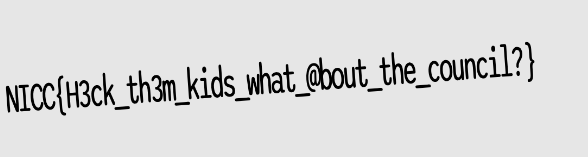

## wont-someone-think-about-children? ##
the process...
1. whats a .svg file again? 💀
- svg is like a png with xml formating

2. viewing file in terminal
*xxd file.svg* 
for what the file is displaying (opened it in windows html), it is quite big... 250 something KB's

3. svg files have layers, like an ONION (get shreked)
looking at the xml of the file, i see the structure of the image, and behind the image of central king building, there is image behind it, in which one of the last layers has the file

