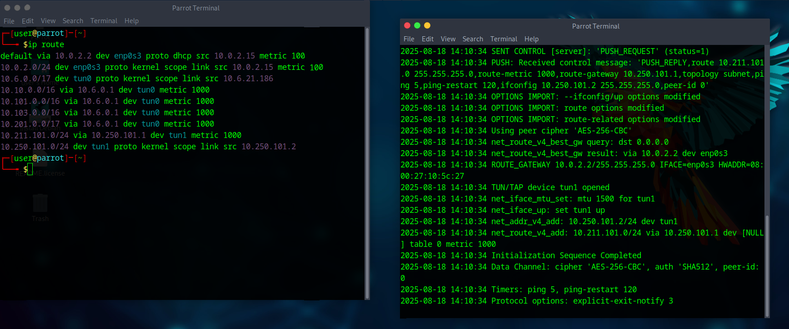
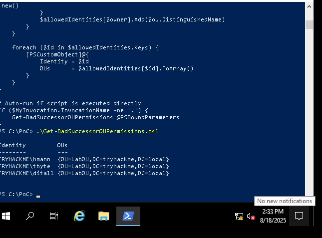

## AD: Bad Successor Attack - TryHackMe Premium Room ##
this room will cover a privilege escalation attack that abuses delegated Managed Service Accounts 

__Step 1: Verify VPN connections to AD Virtual Network__ <br>


__Step 2: Understanding dMSA accounts in AD__<br>
AD has many different types of accounts, from users, computers, services, and group accounts. <br>

- A Managed Service Account is a special type of account in AD that allows running services or scheluded tasks on MS Windows Systems; their key feature is that they do not require a human to manage the password

Three Main types of MSA's:
1. _Standalone:_ designed for a service running on a single computer, in which AD manages account password rotation. Been around since Windows Service 2008 R2

2. _Group:_ Designed for a service running on multiple computers or servers. AD still manages password rotation. Been around since Windows Server 2012

3. _Delegated:_ Most recent addition, enabling migration of legacy service accounts to a machine account. dMSAs are managed by an administrator and allows running a service on a specific server. Introduced in Windows Server 2025 :o. (key note, can take non MSA accounts to being MSA accounts)

### Initial Network Reconaissance ###
To do this exploit, we will be starting from the role of Terry Byte, an IT personnel in the network authorized to test this vulnerability. 

_Once connected to the AD network through RDP:_ <br>
- Run the Get-BadSucessorOUPermission.ps1 script. This script checks and lists all principals that can perform a BadSuccessor attack and the OUs where it holds the required permissions. 


### Exploitation in Windows ###
the goal is to make a dMSA in an OU that the user account has write access to and then from there, being able to modify the dMSA obnject to mimic migration. From there, authentication through that account and accesses TGT's should be possible.

__Steps to Exploit in this Enviroment:__ <br>
1. Utilize SharpSuccessor Proof of Concept Script. this script will handle making an impersonated dMSA account. 
```.\SharpSuccessor.exe add /path:"ou=LabOU,dc=tryhackme,dc=local" /account:tbyte /name:pentest_dmsa /impersonate:Administrator```
2. Once done, you should have this dMSA impersonated, so you will now want to request for a TGT. Easiest way is to use Rubeus, known AD exploiting tool. the tgtdeleg is part opf kerberos unconstrained delegation, and allows a system to impersonate the current user and export their TGT directly from memory.
```.\Rubeus.exe tgtdeleg /nowrap```
3. Using the TGT, you are now able to get the TGS ticket for the account, which since we impersonated an administrator account, it will grant us access to any service ticket for admins. 
4. Grab the TGS for the DC controller, and from there, grab the flag!

### Mitigations and Conclusion ### 
As of now, there is no patch for this from Microsoft, but mitigations would cover identifying what accounts have the ability to create dMSA accounts, and applying least privileges concepts to those accounts (if they dont need to .. do not let them have access to creating dMSA accounts!)<br>