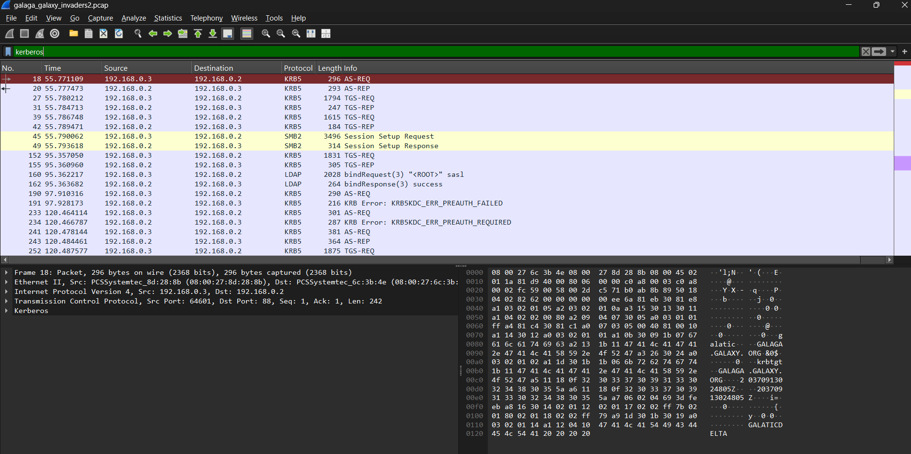
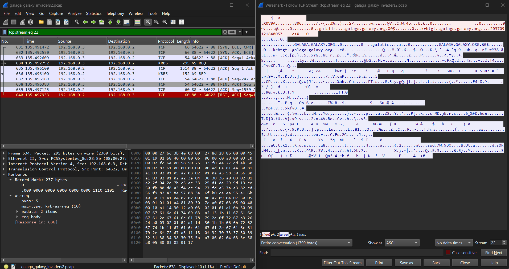
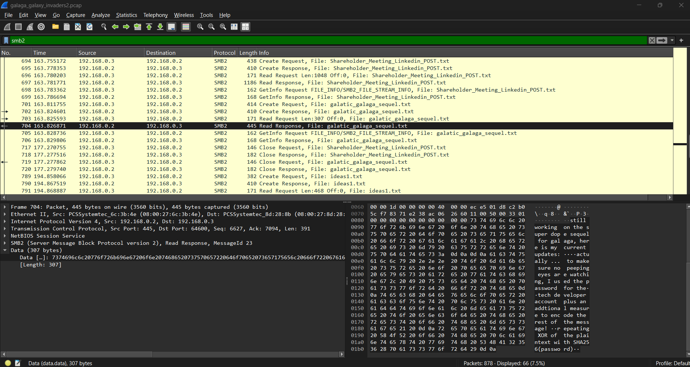
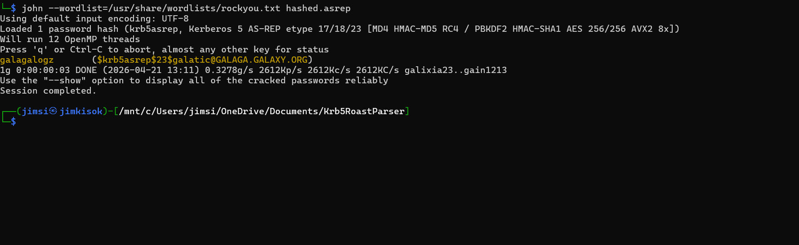

# Galaga Archive - JerseyCTF2026 #
__Challenge Description:__ _I heard rumors that there has been work on a second sequel to the original 1980's Galaga game! I was able to listen to some activity on their network, but it looks like I needed some authentication to reach the shared archive._  

__Given Files:__ galaga_galaxy_invaders2.pcap  
__Tools / Knowledge Base Required:__ Wireshark, Network Packet Analysis, Active Directory, Hashing, Obfuscation  

## Solution Steps ##
Here is the way I would approach this challenge:  
- challenge has roughly 1000~ packets in the capture, not enough to require elegant searches but you have to know what to look for
- challenge mentions authnetication. seeing that this is a windows computer based of some protocols utilized, as well as multiple computers in the capture communicating, searching for Kerberous / NTLM authentication is a good first step

1. identify the Kerberos traffic activity

notice the following, when going through the capture, you can identified multiple AS-REQ and AS-REP packets. these are associated with the first step of kerberous authentication, and in the case of this challenge, is the showcase of the main vulnerability / issue with the way that this Active Directory environment is set up. Look up this if you are not familiar!  
https://www.thehacker.recipes/ad/movement/kerberos/asreqroast 

2. identify that pre-authentication was not provided for the initial TGS request, meaning that you can roast the hash (AS-REP ROASTING)

- why? if you looked later at some of the messages later in the smb stream you can find this message:

3. after obtaining the password from the ticket, you can then look at the traffic capture for SMB, which contains a file that has a message obfuscated within it.

still working on the super dope sequel for galaga, here is my current updates:  

actually ... to make sure no peeping eyes are watching, I used the password for the  
tech developer account plus an addtional measure to encode the rest of the message!  
repeating XOR of the plaintext with SHA256(password)  

4. Knowing that you need the password, pulled the hashed contents from the packets. 
$krb5asrep$23$galatic@GALAGA.GALAXY.ORG:6543d0743a6b31aa2cda4bc375da77c2$63c89aecbb673806a79be8e0a1880474939eaff30ce502ff48d6d89bc3f361e4d09a031b7b9f32ce96a8d9cba17774c4e4c6737764ea2f57e639334fad93d6b9269255749a67b0b4bfd7ca97a057e973516bf44d34cc19a95f5b9a6fac03be04fe3c1db5d95e5c45bad2335687f834b799e9b82fb74c6821ca3e62c03794c70958cc3b1a2d7c9fe327acf9ccb151bc1e459a2416da03bcec8a26e2427d14985998dfc40403c0d4e78090bcf7aa5375109c4f7b10c0dc29a63ecc25adb00418f9f283407a563131ec98516e3f0234907e62c36684f71762a7a37d894e8c8421a5a056e29cfee410a550df27eb2d94348a7f3e239f17ad  
- you can either form this manually by: find encrypt part of asrep response, copy raw value, append beginning information, or use a tool that can parse pcap files and do it automatically:
https://github.com/jalvarezz13/Krb5RoastParser  

- from here you can use john or hashcat to rip this and find the password for this user:

5. in order to obtain the following message about the smb stream with the contents on the new galaga game, follow the directions of the cryptic message, which is to take a SHA256 hash of the password, and use it to perform a XOR operation on the ciphertext. this will reveal the final message, giving the flag. this will be two on two files in combination (ideas1 and ideas2), which should net the final message. Note that the XOR operation has to be a revolving XOR, as the sha256 hash of the password is not as long as the message provided.

final message:  
cool! here is my update for you. I still have not developed anything yet, a lot is still in the brainstorming stage. I am not  
sure if there should be multiple boss stages, but it should definitely have a more dynamic progression system, it would be dope  
if we implement a rogue-like progression system. other then that, I do not have much else to update  but ill make sure to keep  
you update! jctf{roasted_galatic_invaders}  
