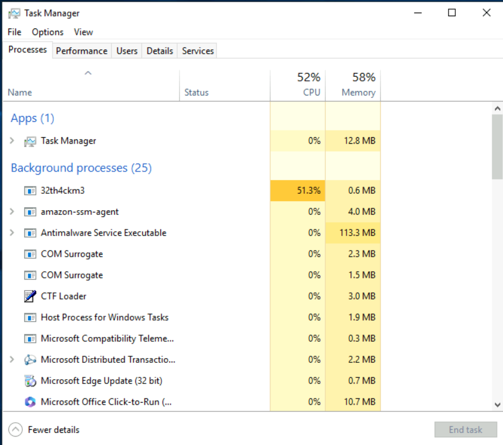
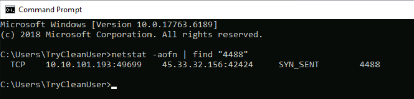
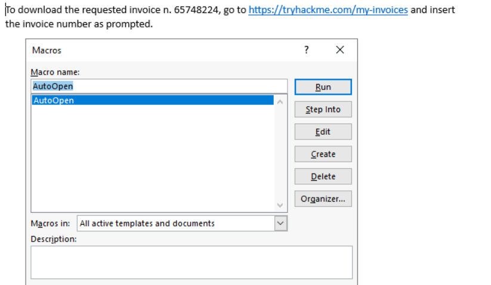

## Windows Incident Response Process ##
another yummy TryHackMe lab! post CySA+ so this should be a good test of practical skill  

### Task 2: Initial Context ###
__Scenario:__
The user contacted the IT Team, reporting that his laptop started acting up and became extremely slow, to the point that he was having trouble working. The user couldn't pinpoint exactly what he was doing when the computer suddenly slowed down. He was browsing the web and working on some documents, as usual. He tried rebooting the machine, but performance was still very low. The SOC Team has verified that no alert was raised on the SIEM or EDR platforms for the workstation. The only anomaly that we have identified is some outbound connections on the perimeter firewall originating from the workstation's IP. The connections occur every second, and all have the same destination IP. The connections are not blocked by the FW. We have gone back to the user, who doesn't acknowledge these connection attempts.  

okay so SIEM and EDR tools were not able to alert the event, so after network segmentation and evidence preservation, its time for analysis of the machine.  

### Task 3: Detection and Analysis ###
_After opening task manager_, there is a abnormal process of sudo-random aphla-numeric numbers, which is eating up system cpu.  
  

this file follows all of the sus indicators of bad programs, its located in a temp folder, eating WAY too much resources, and is not one of windows main known system processes.   PID 4488  

knowing the PID and also context that the system is making outbound connections, we can use netstat to confirm if this suspicous process is the one making the network connection.  

_find_ --> windows version of grep command.  

from here, with the now knew malicious IP address, the organization can make more steps to mitigate potential impact, such as adding rules to the firewall to block this address, and search through SIEM logs to see if this address is found on other endpoint devices on the network.  

malware analysis is not in the scope here, but from this stp, we can dig into more root cause issues, of how the user got the bad program, and we can start by looking at browser download activity.  

invoice file is highly suspicious, for multiple reasons:
- weird naming convention
- .docm file: word document, but it can also contain executable malware, think back to tyhackme industrial CTF challenge! 
- from http: //172.233.61.xxx: http protocol to external network address, no shot this can be non-benign activity

we opening the file now ... gulp. really should highlight the fact that this machine is isolated from the rest of the network, would not want this to spread to potential other endpoint machines!  

multiple __red flags__ in the macro:
- establish the malicious process in temp folder, executable pulled from external ip
- hides black cmd shell when executing
- creates new registry key in HKCU\\..\CurrentVersion\Run, which creates persistance on startup of the machine.
- infinite do while loop after initial setting "DoEvents", which must be the function that this malicious process is executing. 
- utilize certutil, a legit windows cmd line tool for managing and creating certificate authorities... nice stealth option!

### Task 4: Containment, Eradication, and Recovery ###
_containment:_ this thing is already partically contained, as efforts to isolate it from the rest of the network has stopped any potential spread of this incident. time to remove this guy!

_Eradication:_
1. Stop process in task manager
2. remove persistance in registry keys 
3. remove malware files in temp directory
4. remove malicious invoice file
5. clear browser history