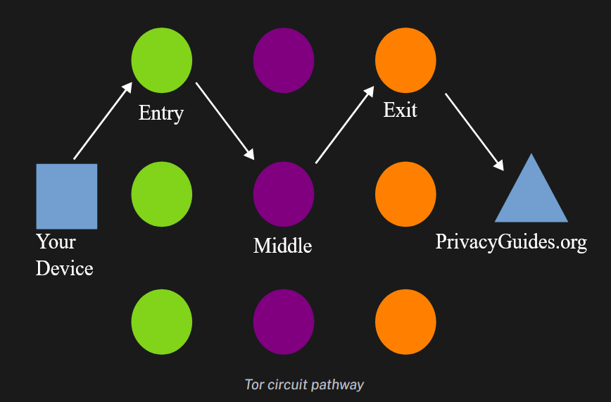

# Tor Notes #

_Tor_ is a decentralized network architecture which is commonely used to surf the deep web, avoid government censorship, and masking/anonymous internet activity. To truly provide privacy from ISP's (Internet Service Providers) and other peering eyes, TOR is usually also used in addition with trusted VPN providers to hide the initial connection to the Tor Network.  
- reason is that TOR traffic is unique looking, so network adminstrators can view and prob be suspicious of it
- VPN --> privacy (if trusted)
- Tor --> anonymize traffic

similar to a proxy!

## How it Works ##
  
_every time you connect to a website through tor, it will create a circuit to travel from node to node until it reaches the destination_  

### Entry Node ###
The entry node, often called the guard node, is the first node to which your Tor client connects. The entry node is able to see your IP address, however it is unable to see what you are connecting to. Unlike the other nodes, the Tor client will randomly select an entry node and stick with it for two to three months to protect you from certain attacks (cited from resource 1)  

### Middle Node ###
the middle node will see the node that the traffic came from, and the next node it needs to travel to. it can not see the IP address or domain you are connecting to.  

### Exit Node ###
the exit node is the point where the web traffic leaves the Tor network and is forwarded to the desired destination. it wont know what IP address it came from, but will know the site you are connecting to.  

this node will be chosen from random of all available tor nodes with the exit relay flag.  

## Path Building to Onion Services ##
__Onion Services:__ websites that can only be accessed with tor browser, having long randomely generated domain names, and ending with the .onion postfix.  

now the strategy is a bit different, with there being now 6 nodes to connect to, 3 being for your anonmymity, and the other three so that the server doesnt know your identity.  
(this is where the mostly bad perceived traffic is going)  

## Encryption with TOR ##
tor will encrypt each packet three times, with keys held at the exit, middle, and entry. at each node, the layer corresponding key will be removed, and so it 'drops' a shell of encryption.  

## Concerns with TOR ##
1. anyone can set up an exit node for traffic.
there has been situations in the past of the exit nodes de-encrypting traffic (HTTPS->HTTP), which brings into concern of the maintainers of the nodes (NSA be spinning up nodes in attemtps to track Tor activity)
2. there is a negative stigma with Tor usage
network enginners who view this type of traffic will assume that malicious activities are occuring when noticed
3. tor usage is not undetectable
most methods of hiding tor use is through obfuscation, and can be mitigated with effort
4. tor can not protect you from revealing your own identity
a lot of big black market busts coming from threat intelligence on specific individuals removing there anonymity through accounts, emails, reused aliases ... 
5. tor nodes can modify unencrypted traffic that passes through, so DONT ever download files from a website through tor on HTTP

## Resources Used ##
https://www.privacyguides.org/en/advanced/tor-overview/#safely-connecting-to-tor
https://snowflake.torproject.org/

look it pluggable transports, method for masking tor traffic from censorship
pose the benefits through:
- low risk, research, examples
