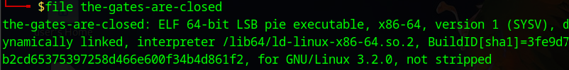

## the_gates_are_close ##

__challenge:__ A USB drive was found in front of the locked gates of an abandoned cemetery. It may contain information regarding the strange sightings reported to nearby authorities in the graveyard, which NICC decided to investigate. 

what i did:

1. open terminal --> file _____

2. elf least sig exe, opening it in ghidra for analysis:
3. after compiling in ghidra, looking at main function, nothing important
4. checking other function, (secret function name?)
    - puts function: strout 
    
5. text appears to be Base64, the equal sign is a pretty sure giveaway
TklDQ3s0X1IzNGxfRmw0Z30= 
6. convert to text with cyberchef, get flag
NICC{4_R34l_Fl4g} 

