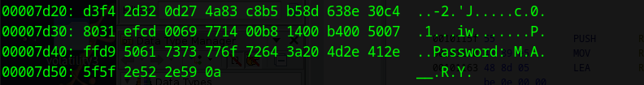

## whispers_in_morse ##

stego tools used
xxd        strings      file       stegohide        morse_code_translator

1. download file
2. check file type, is jpeg (JFIF)        file MaryMorse.jpg
3. check hex with xxd                     xxd MaryMorse.jpg

*end of file states theres a password*
4. hrm password, maybe there is some embedded data, use stegohide
5. asks for password, recall morse, password is MARRY (cant recall exact way it was typed, might of been like marry m.a.r.r.y, i dont recall 💀)
6. get extracted file, in which the flag is within:
NICC{tHe_whIspeRz_iN_Th3_aiR} 

i did attempt a different way of obtaining the solution, which involve me making a python script that extracted all spaces, tabs, and end chars (\\) in the file bc I saw a lot of loose spacing when i hit strings on the file, but it did not return with anything significant...
script in script folder, pretty clean code!
bracket indicates end of word,  
--.|-.|.--.-.|-.-....--|.|-..-.-|..-.-.|...|.
