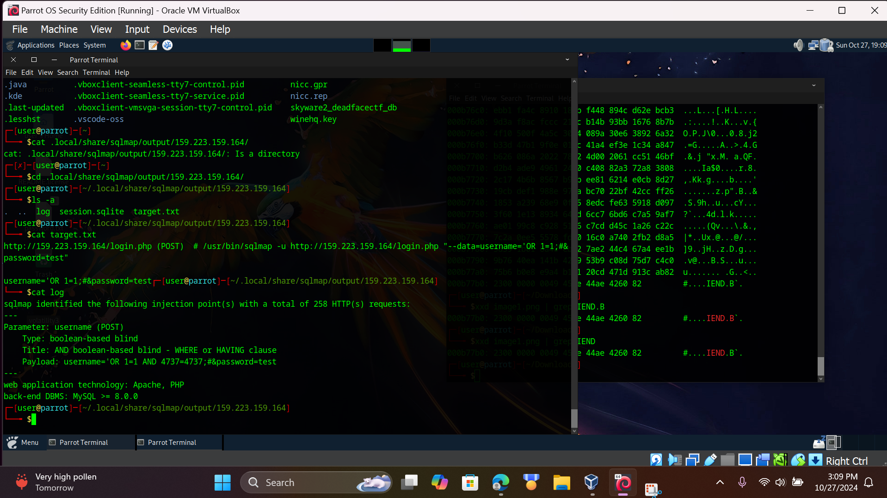

## cryptid_hunters ##

one thing that I picked up from someone else is when approaching web challenges, think abt __OWASP top ten__... you may be like what? but most of the time, lower level challenges tend to pull some vulrenablitily listed there. in this case it was an injection attack 

first time really using __sqlmap__ on my vm, at first I was manually creating the queries, in which I could deduct for the sites logic that it was a MySQL database. (spefically *blind SQL injection*, website did not spit out errors, but user input was not validated or checked) 

after that, ended up using sqlmap to further pen test the website, and got a query that bypassed the login.php page  
 

in creatures page, flag can be found at the bottom.
